## Testing

*Index.html*
* When not logged in a message appears center of screen to inform user they can browse or register to create a feature
* 'Enter' button brings the non logged in user to a bug page displaying bugs
* 'Register' button brings the user to the register page where they can register
* The footer sits at the bottom of the page and is displayed when the user scrolls down the page

*Navbar*
* The links on the navbar do not include 'graphs' and 'profile' when the user is not logged in
* When logged in graphs and profile are displayed along with logout
* All links work as expected home,bugs,features,graphs,profile,logout,login,register,cart
* The navbar is responsive and collapses on small devices and mobile

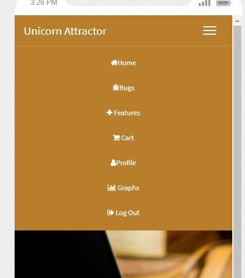

*Base.html*
* * 'The Unicorn Attractor' logo on the navigation menu directs to the index/home page
* The 'Home' button on the navigation menu directs to the index/home page
* The 'Bugs' button brings the non logged in user to a bug page 
* The 'Features' button brings the non logged in user to a feature page 
* The 'Register'  button brings the non logged in user to the register page where they can register
* The 'Login' button brings the user to the login page to login after registration
* Tested on mobile the menu collapses to the right of the nav bar as tiled icons and opens to the center of screen
* Tested on Galaxy 5, Iphone 5/6/7/8, iPad, iPad Pro
* When logged in a message appears that the user is logged in. 
* When logged in 'Cart','Profile','Graphs','Logout' buttons are displayed

*Profile.html*
* Username and email is displayed for the logged in user

*Bugs*
* Bugs that have been added are displayed correctly
* When a user has logged in the 'add bug' button is displayed
* Bug status (added by the admin) is correctly displayed
* Bug name, description and day/time bug added are displayed correctly 
* Bug app is responsive and correctly changes as coded according to grid system
* A search box is displayed and works as expected filtering on name of bugs

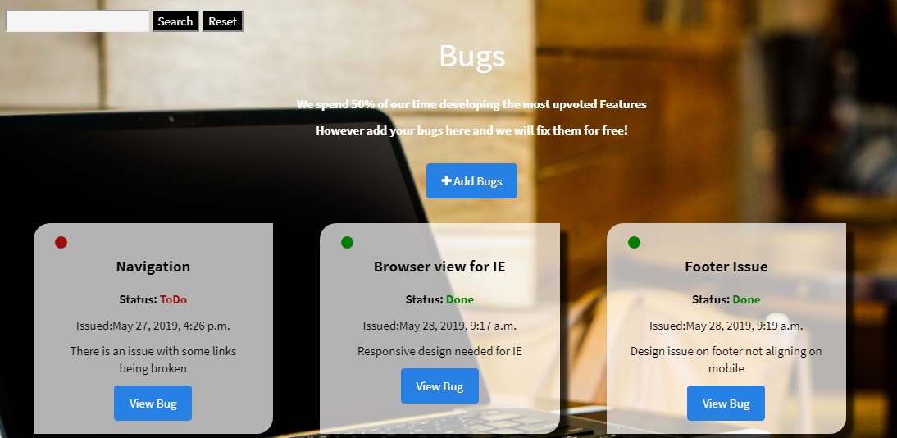
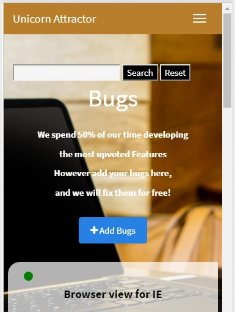

*Bugs Detail*
* Upvote button is dispalyed an works as expected
* A counter for views is dislpayed and increments as expected
* The bug counter displays correctly
* A user can only upvote a bug once - an upvote success message is displayed correctly
* A logged in user can post comments on the bug 
* A back button brings the user back to the bugs app

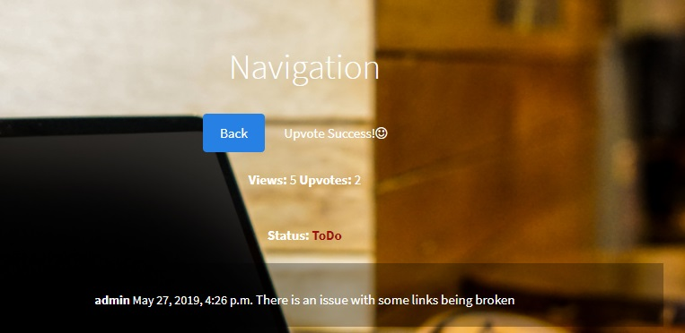
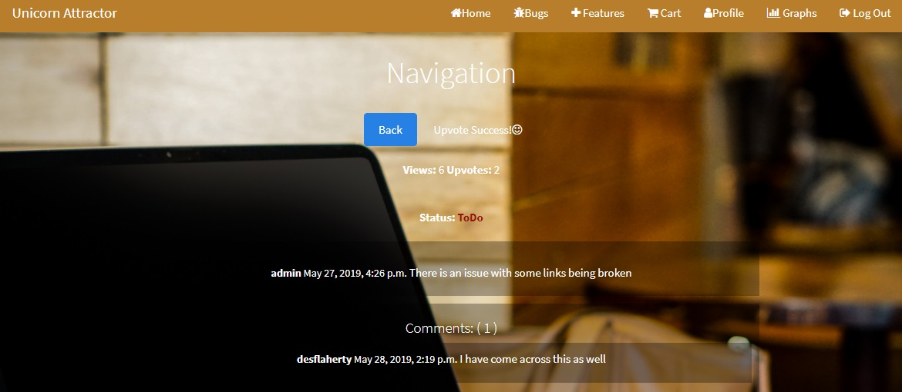

*Features Detail*
* Upvote button is dispalyed an works as expected
* A counter for views is dislpayed and increments as expected
* The feature counter displays correctly
* A user can only upvote a feature once - an upvote success message is displayed correctly
* A logged in user can post comments on the feature 
* A back button brings the user back to the feature app
* A cart button is available for loggin in users
* A feature can be added to cart only once 
* A counter is dislpayed on the cart link in the navigation menu

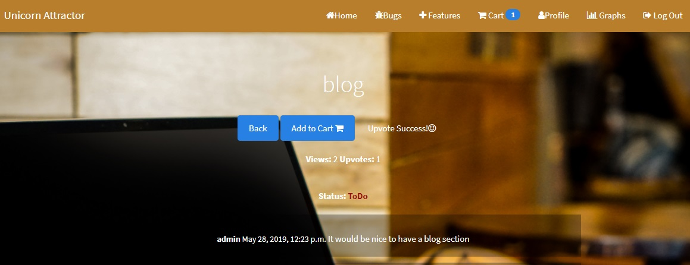

*Add Bugs/Features*
* A logged in user can add a bug or feature name and description
* Admin user can also add a status when creating a bug or feature such as 'To Do','Doing','Done'
* An Edit button is available for Admin can works as expected allowing editing of bug/feature to set a status of users issues

*Cart*
* Features that have been added to the cart are displayed as expected
* The cost of each feature and overall cost is displayed
* A checkout button is displayed 
* Cart is responsive for iphone and other devices tested

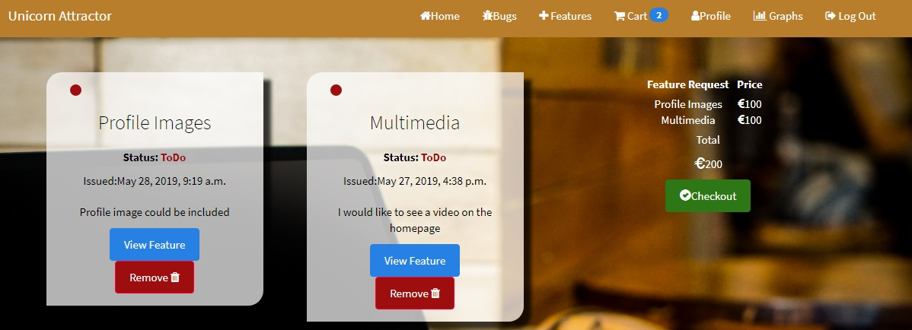

*Checkout*

* A checkoutform is displayed as expected
* Input vaues are avaialble for credit card details
* Price of features is dislpayed 
* Stripe API works as expected 
* A test credit card number can be entered and is processed successfully
* A messge is displayed to the user that payment was successful

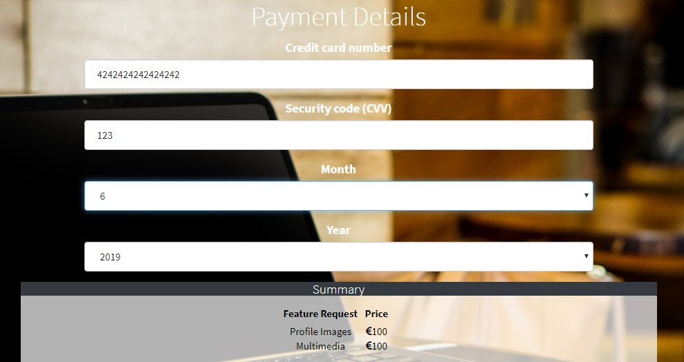
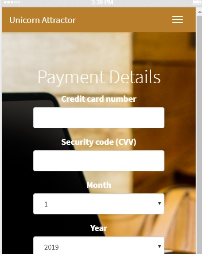

*Graphs*
* A pie chart is displayed showing the count of features by live status
* A pie chart is displayed showing the count of bugs by live status
* Graphs are responsive for ipad and iphone

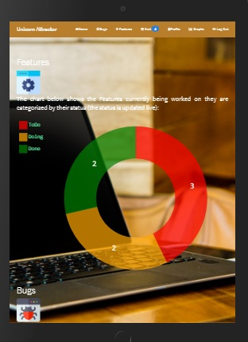
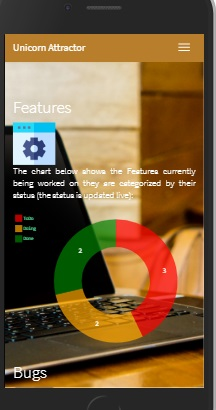

## Responsive Testing
* Responsinator was used to check responsiveness of different devices - https://www.responsinator.com 
* Google Chrome developer was also used.
* Devices tested on include: Galaxy S5, iPhone 5/SE, iPhone 6/7/8, iPhone 6/7/8 Plus, iPhone X, iPad, iPad Pro, Desktop PC

## Browser Testing
* Browsers tested were Google Chrome,Internet Explorer and Firefox. Also the Safari browser on iPhone.

The criteria used for testing included:

* Functionality
* Navigation
* Display

The format used for testing can be viewed below. 

| Feature         | Device        | Browser   | Result | 
| -------------   |:------------- | :------   | :----- |
| Nav Links       |IPhone         | Chrome    | Pass   |
| Register        |IPhone         | Chrome    | Pass   |
| Login           |IPhone         | Chrome    | Pass   |
| Bugs            |IPhone         | Chrome    | Pass   |
| Features        |IPhone         | Chrome    | Pass   |
| Bug Detail      |IPhone         | Chrome    | Pass   |
| Feature Detail  |IPhone         | Chrome    | Pass   |
| Logout          |IPhone         | Chrome    | Pass   |
| Cart            |IPhone         | Chrome    | Pass   |
| Checkout        |IPhone         | Chrome    | Pass   |
| Graphs          |IPhone         | Chrome    | Pass   |
| Nav  Links      |Desktop        | Chrome    | Pass   |
| Register        |Desktop        | Chrome    | Pass   |
| Login           |Desktop        | Chrome    | Pass   |
| Bugs            |Desktop        | Chrome    | Pass   |
| Features        |Desktop        | Chrome    | Pass   |
| Nav  Links      |Desktop        | IE        | Pass   |
| Register        |Desktop        | IE        | Pass   |
| Login           |Desktop        | IE        | Pass   |
| Bugs            |Desktop        | IE        | Pass   |
| Features        |Desktop        | IE        | Pass   |

